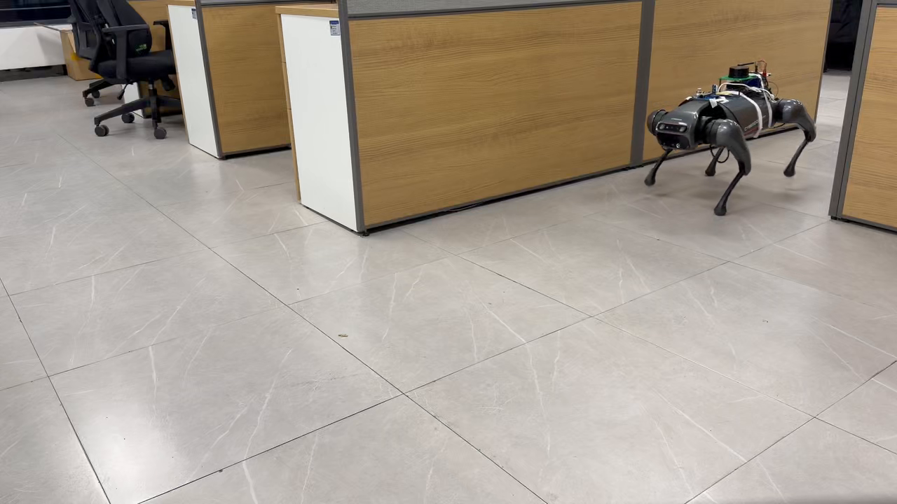

# MOCHA Core (Anonymous Artifact)

This repository is an anonymized, code-only snapshot of the core MOCHA optimizer used in the paper submission.

Only the optimizer core, one Ackermann configuration example, and a few pre-generated media assets are kept here. ROS nodes, launch files, experiment drivers, maps, result folders, and build outputs are intentionally removed.

## Environment

- Ubuntu 22.04 (the original development environment was WSL2 on Windows)
- C++17 compiler
- Eigen3
- `yaml-cpp` if you want to parse the retained YAML configuration in your own tooling

## Repository Layout

- `include/mocha_planner/core/`: public headers of the optimizer core
- `src/core/`: core implementation
- `third_party/lbfgs.hpp`: bundled L-BFGS dependency
- `config/ackermann_reverse_parking.yaml`: retained Ackermann reverse-parking configuration example
- `media/`: media used by the paper/demo page

## Notes

- This artifact keeps only the core algorithm code.
- No ROS runtime wrappers, launch files, benchmark programs, plotting scripts, or build scripts are included.
- The YAML file is preserved as a parameter reference only.

## Media

### Exp. 1: Reverse Parking

### Exp. 4: Dynamic Obstacle Avoidance

### Physical Robot Experiment

Click the preview image above to open the video file.
