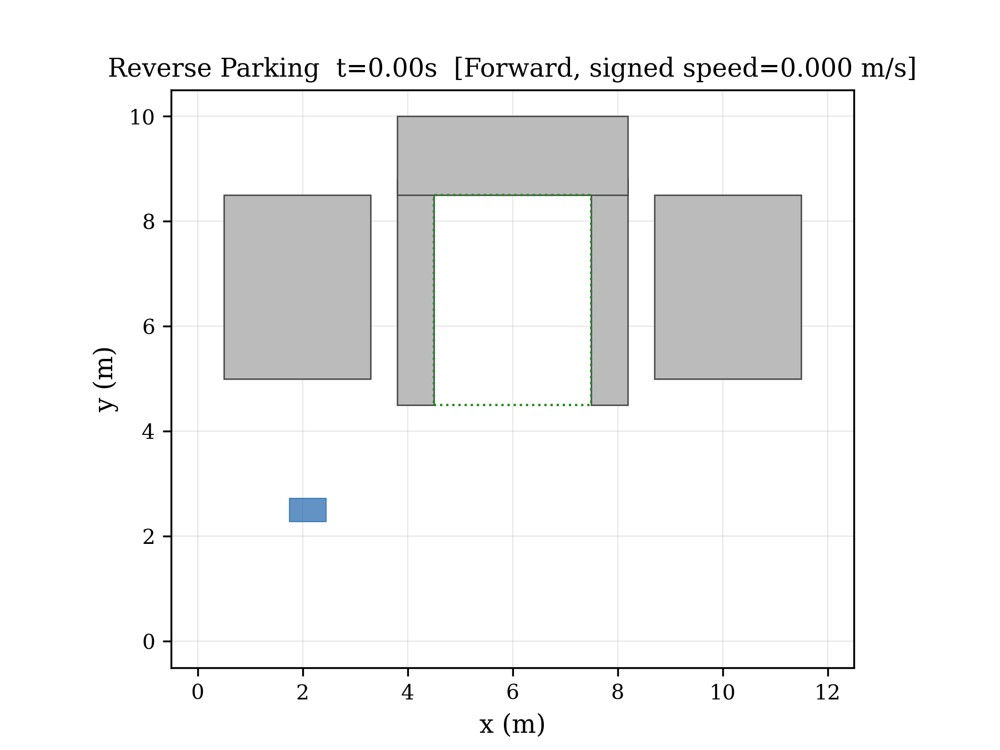
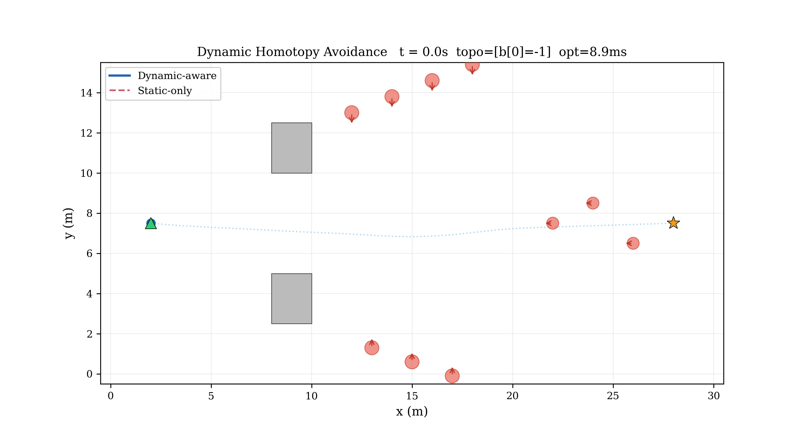

# MOCHA Core

### Exp. 1: Reverse Parking

  

### Exp. 4: Dynamic Obstacle Avoidance

  

### Physical Robot Experiment

  

This repository keeps only the core optimizer code, one Ackermann configuration example, and the media shown above. ROS nodes, launch files, experiment drivers, maps, result folders, and build outputs are intentionally removed.

## Environment

- Ubuntu 22.04
- C++17 compiler
- Eigen3
- `yaml-cpp` if you want to parse the retained YAML configuration in your own tooling

## Repository Layout

- `include/mocha_planner/core/`: public headers of the optimizer core
- `src/core/`: core implementation
- `third_party/lbfgs.hpp`: bundled L-BFGS dependency
- `config/ackermann_reverse_parking.yaml`: retained Ackermann reverse-parking configuration example
- `media/`: media assets used in the README

## Notes

- Only the core algorithm code is kept here.
- No ROS runtime wrappers, launch files, benchmark programs, plotting scripts, or build scripts are included.
- The YAML file is preserved as a parameter reference only.
